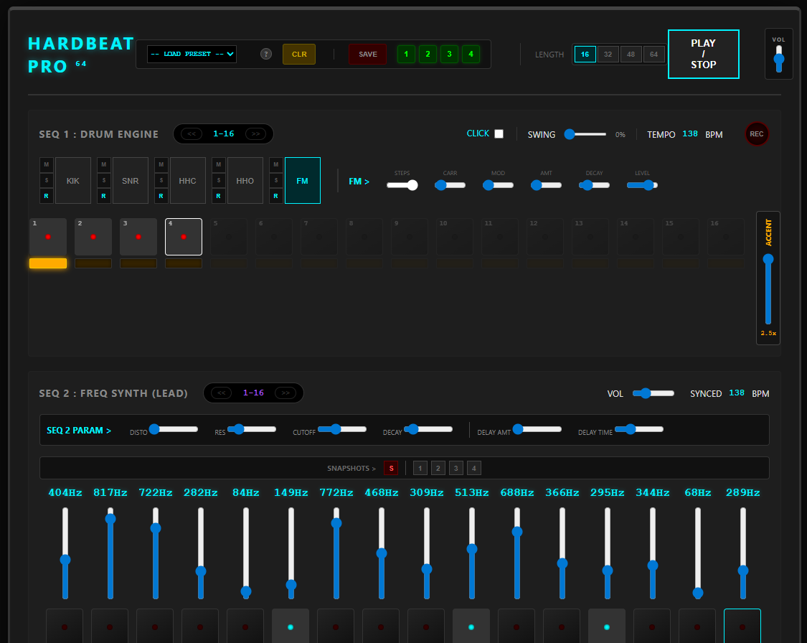

#  HARDBEAT PRO (V12 GOLD)
> **Browser-Based Hardgroove Workstation**


**Hardbeat Pro** est une boîte à rythmes et un synthétiseur techno tournant entièrement dans le navigateur. Conçue pour la performance live et la composition de **Hardgroove** et de **Techno Industrielle**, elle se distingue par son moteur audio natif à faible latence et sa gestion avancée de la polyrythmie.


<br>
<div align="center">
  
</div>
<br>

🔗 **[LANCER L'APPLICATION (LIVE DEMO)](https://binokub.github.io/HARDBEAT-DEV/HARDBEAT-PRO.html)**

---

##  Fonctionnalités Clés

* **Séquenceur 64 Pas :** 4 mesures complètes pour des boucles évolutives (pas limitées à 16 temps).
* **Polyrythmie Réelle :** Chaque piste (Kick, Snare, HHC...) possède son propre curseur de longueur de boucle (Loop Length). Créez des décalages complexes (ex: 3 temps vs 4 temps) en un clic.
* **Moteur Audio "Rumble" :** Synthétiseur de basses fréquences dédié (SEQ 3) avec distorsion et filtrage pour le son techno moderne.
* **Export WAV Studio :** Enregistrement de la sortie Master en temps réel vers un fichier `.wav` non compressé.
* **Accents Dynamiques :** Gestion de la vélocité sur les Drums et "Ghost Accents" (ouverture de filtre) sur les Synthés.
* **Zéro Framework :** Construit en 100% Vanilla JavaScript (ES6) pour une performance maximale sans bloatware.

---

##  Installation & Développement

Ce projet ne nécessite aucune installation de dépendance (npm, node_modules...). Il utilise les standards web natifs.

### 1. Cloner le dépôt
```bash
git clone https://github.com/binokub/HARDBEAT-DEV.git

2. Lancer l'application
Ouvrez simplement le fichier HARDBEAT-PRO.html dans un navigateur moderne (Chrome, Brave, Edge).

Note pour l'Export WAV : En raison des politiques de sécurité des navigateurs (CORS), la fonction d'export audio fonctionne mieux si le projet est hébergé sur un serveur local (ex: Live Server sous VS Code) plutôt qu'en ouverture de fichier directe (file://).

 Documentation
Le projet contient une documentation complète pour les musiciens et les développeurs.

 Manuel Utilisateur (Handbook) : Le guide complet pour apprendre à utiliser la machine.

 Wiki Technique (GitHub) : Documentation de l'architecture code, du moteur audio et de la structure des données JSON.

 Preset Generator : Outil interne pour générer le code JSON des patterns complexes.

 Structure du Code
audio.js : Le cœur du moteur sonore (Oscillateurs, Filtres, FX).

logic.js : Le cerveau du séquenceur (Boucle temporelle, UI updates).

presets.js : La base de données des motifs.

storage.js : Gestion de la sauvegarde locale.

recorder.js : Moteur d'encodage WAV.

 Licence
Projet Open Source. Conçu par Binokub.
Code is Art. Techno is Life.
